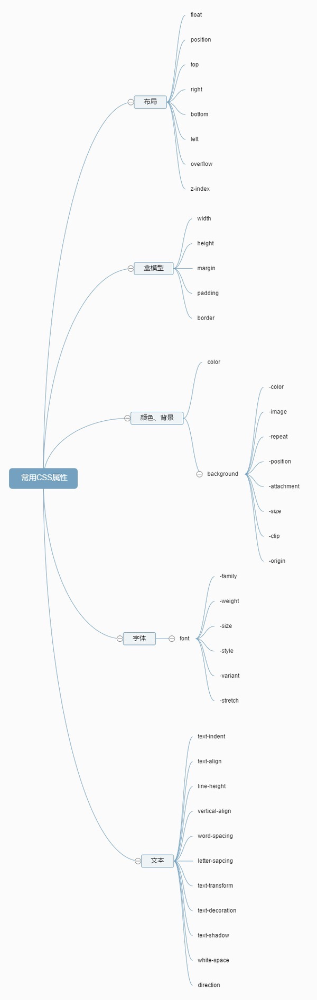

## 2016.02.27 -- 2016.06.01 

### JavaScript

+ 看完 《JavaScript 高级程序设计》。共 730 页，平均每天看 20 页。

### jQuery

+ 《jQuery 教程》 [http://www.runoob.com/jquery/jquery-tutorial.html](http://www.runoob.com/jquery/jquery-tutorial.html) 

### Bootstrap

+ 官网 [http://www.bootcss.com](http://www.bootcss.com)

### Node.js

+ 《Node.js 包教不包会》[https://github.com/alsotang/node-lessons](https://github.com/alsotang/node-lessons) 
	- Lesson 0: 《搭建 Node.js 开发环境》
	- Lesson 1: 《一个最简单的 express 应用》
	- Lesson 2: 《学习使用外部模块》
	- Lesson 3: 《使用 superagent 与 cheerio 完成简单爬虫》
	- Lesson 4: 《使用 eventproxy 控制并发》
	- Lesson 5: 《使用 async 控制并发》
	- Lesson 6: 《测试用例：mocha，should，istanbul》
	- Lesson 7: 《浏览器端测试：mocha，chai，phantomjs》 -- by @elrrrrrrr
	- Lesson 8: 《测试用例：supertest》
	- Lesson 9: 《正则表达式》
	- Lesson 10: 《benchmark 怎么写》
	- Lesson 11: 《作用域与闭包：this，var，(function () {})》 -- by @Ricardo-Li
	- Lesson 12: 《线上部署：heroku》
	- Lesson 13: 《持续集成平台：travis》
	- Lesson 14: 《js 中的那些最佳实践》
	- Lesson 15: 《Mongodb 与 Mongoose 的使用》
	- Lesson 16: 《cookie 与 session》 -- by @Ricardo-Li
	- Lesson 17: 《使用 promise 替代回调函数》 -- by @eeandrew
	- Lesson 18: 《何为 connect 中间件》 -- by @albin3

### React.js

+ 《React 入门实例教程》[http://www.ruanyifeng.com/blog/2015/03/react.html](http://www.ruanyifeng.com/blog/2015/03/react.html)
+ 《Docs》[http://facebook.github.io/react/docs/getting-started.html](http://facebook.github.io/react/docs/getting-started.html)

### SQL

+ 《SQL 教程》[http://www.runoob.com/sql/sql-tutorial.html](http://www.runoob.com/sql/sql-tutorial.html)

### MySQL

+ 官网 [http://www.mysql.com](http://www.mysql.com)
+ 《MySQL 教程》[http://www.runoob.com/mysql/mysql-tutorial.html](http://www.runoob.com/mysql/mysql-tutorial.html)

### MongoDB

+  官网 [https://www.mongodb.org](https://www.mongodb.org)
+  《MongoDB 教程》[http://www.runoob.com/mongodb/mongodb-tutorial.html](http://www.runoob.com/mongodb/mongodb-tutorial.html)

### 计算机网络
	
### CSS

 
