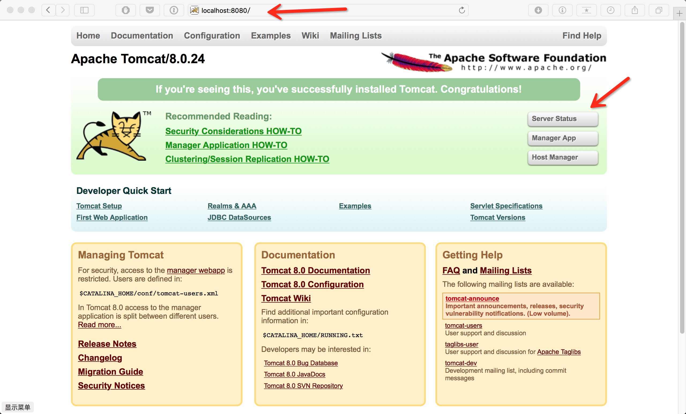
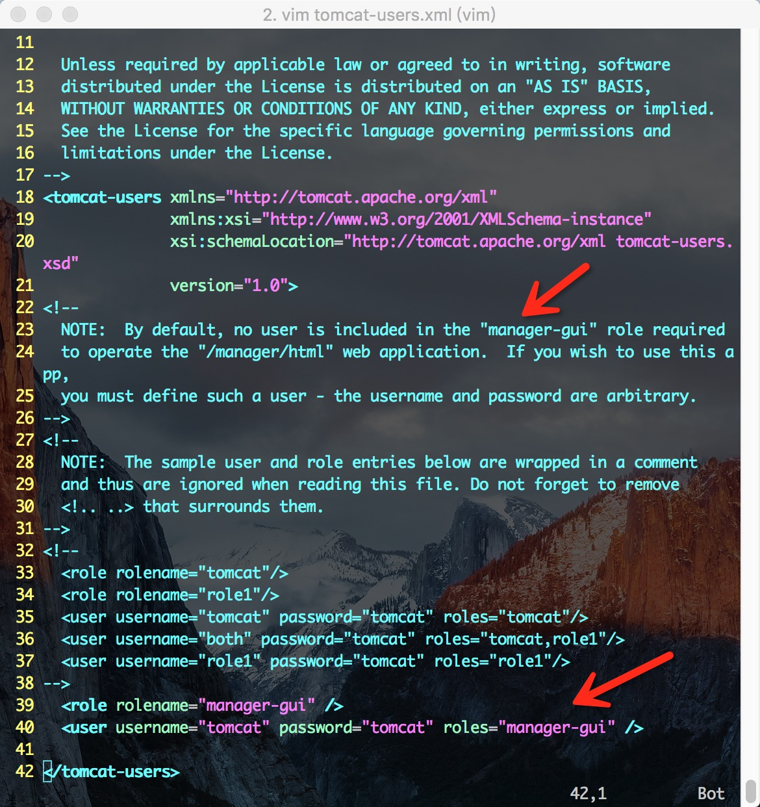
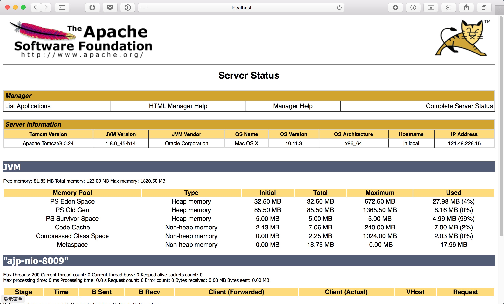

## 开发环境的配置

### Windows 下 JAVA 环境配置

参考：[Java 开发环境配置](http://www.runoob.com/java/java-environment-setup.html)

### Ubuntu 下 JAVA 环境配置

#### 1. 安装过程

安装过程主要参考：[ubuntu下搭建JAVA开发环境][1]

#### 2. 需要注意的地方

##### 1) Linux 解压命令

```
`tar -zxvf  xxx
```
`

+ -x或--extract或--get：从备份文件中还原文件
+ -v：显示操作过程
+ -f\<备份文件\>或--file=\<备份文件\>：指定备份文件
+ -z或--gzip或--ungzip：通过gzip指令处理备份文件

更多详情参考：[http://man.linuxde.net/tar][2]

##### 2) Java 安装路径

在该教程中，作者的 Java 安装目录是 `/opt/software/java`。这个路径是可以自己设置的。

在 Linux 系统中，如下几个目录都是用来存放安装软件的，但略有不同：

+ `/opt` : 这里主要存放那些可选的程序。
+ `/usr/local`: 这里主要存放那些手动安装的软件。如一些自定义脚本。
+ `/usr`: 包管理器（如 apt-get）安装的软件。

##### 3) 环境变量的配置

作者给出的环境变量中全部都使用的绝对路径。其实在配置好了 `JAVA_HOME=/opt/software/java/jdk1.8.0_73` 后就可以用 `$JAVA_HOME` 得到 `JAVA_HOME` 这个变量，然后就可以直接使用相对路径。

如下所示：

```
export JAVA_HOME=/opt/software/java/jdk1.8.0_73
export JRE_HOME=$jAVA_HOME/jre
export CLASSPATH=.:$JAVA_HOME/lib:$JAVA_HOME/lib
export PATH=$JAVA_HOME/bin:$JRE_HOME/bin:$PATH
```


将上面几行代码加入到 .bashrc文件结尾即可。

[1]:	http://jingyan.baidu.com/article/86fae346b696633c49121a30.html
[2]:	http://man.linuxde.net/tar

### JSP 开发环境的配置

#### 安装 Tomcat

参考：[JSP 开发环境搭建](http://www.runoob.com/jsp/jsp-setup.html)

#### 配置 tomcat-users.xml

Tomcat 安装成功后，在浏览器中输入 `localhost:8080` 会出现如下界面。如果没有出现，说明没有安装成功。



右上角的三个按钮可以登录到 tomcat 后台，查看服务器运行信息。

不过要先对管理员用户信息进行配置。Tomcat 的管理员配置信息在 `$TOMCAT/libexec/conf/tomcat-users.xml`，其中 `$TOMACT` 表示 Tomcat 的安装目录。配置文件 `tomcat-users.xml` XML 格式的文本文件，XML 和 HTML 类似，但 XML 语法更严格，标签可以自定义。文件内容长这样：



`<!--` 和 `-->` 中间的内容都是是注释。配置文件注释的第 23 行提到说，目前没有用户属于 `manager-gui` 这个用户组，而 `manager-gui` 用户组中的用户是用来管理 Tomcat 后台的。从命名也可以看出，该用户组主要是使用图形用户界面(GUI)进行后台管理。这里的图形界面就是值得浏览器。

所以我们要添加一个属于 `manager-gui` 用户组的用户。配置格式如第 33 行至第 37 行所示。

如图，其中第 39 行和第 40 行是我刚添加进去的管理员配置信息。顾名思义，`role` 就表示用户角色，`user` 表示用户信息。配置好了之后，再添加右上角的 `Server Status`，使用刚配置的用户名和秘密就可以登录了。登录后的界面长这样：




