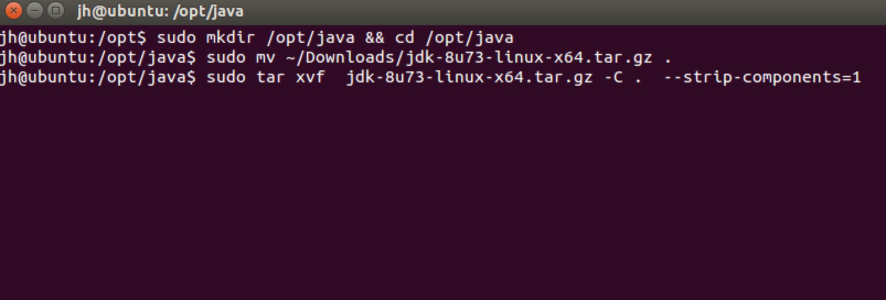
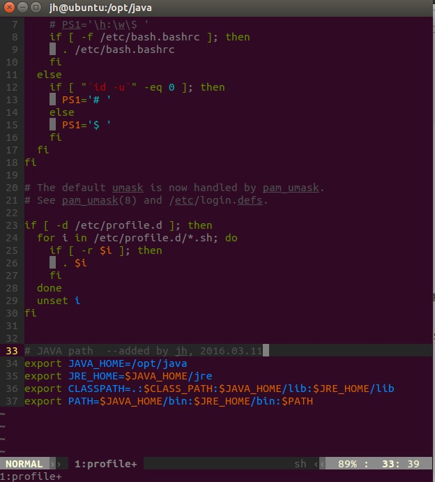
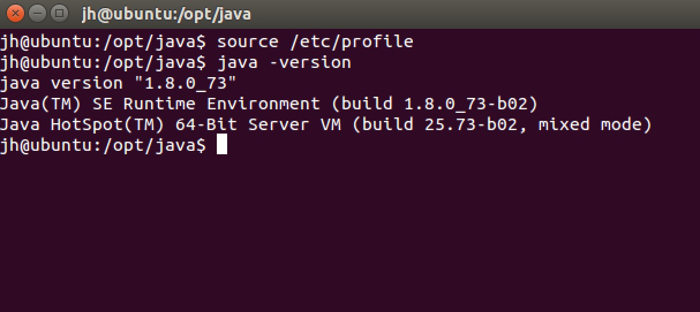
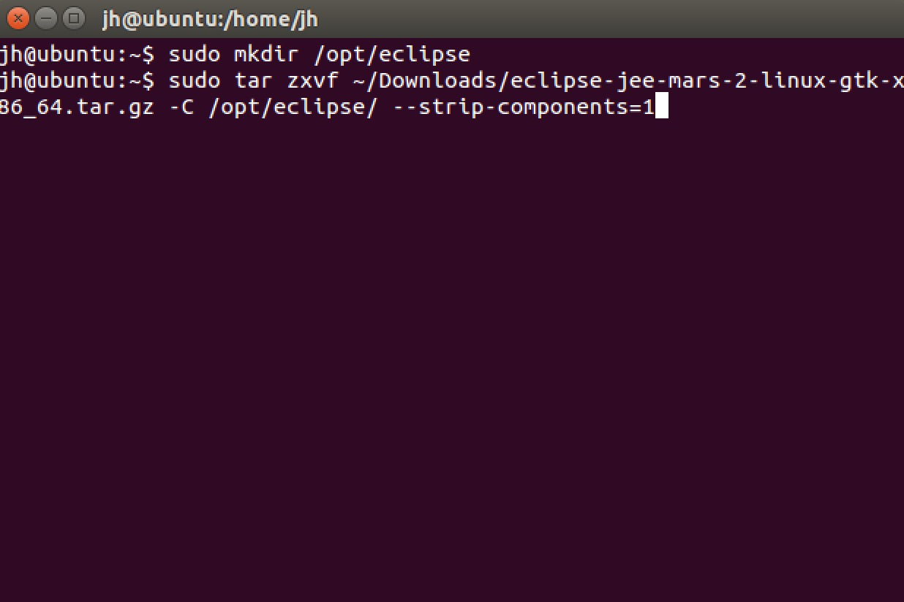
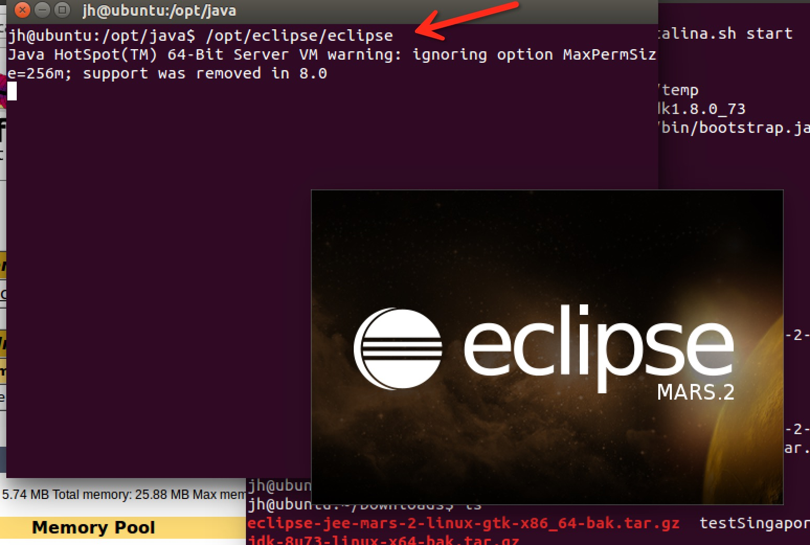

## Ubuntu下JAVA开发环境的配置

### 1. 下载 JDK

建JAVA开发环境，第一步就是要安装JDK。在这里下载：[Java SE Development Kit 8 - Downloads](http://www.oracle.com/technetwork/java/javase/downloads/jdk8-downloads-2133151.html)


### 2. 解压 JDK 压缩文件

首先在 `/opt` 新建 `java` 目录，并进入该目录：
```
sudo mkdir /opt/java && cd /opt/java
```

然后将下载的软件移动到 `/opt/java` 目录：

```
sudo mv ~/Downloads/jdk-8u73-linux-x64.tar.gz .
```

再然后解压压缩包：

```
 sudo tar zxvf jdk-8u73-linux-x64.tar.gz --strip-components=1
```

完整命令截图如下：



解压后大概是这样的：


### 3. 配置环境变量

Ubuntu 系统环境变量的配置方法有很多种。而 JAVA 的环境变量一般情况下是需要对系统的每个用户都要生效。所以我们选择对 `/etc/profile` 文件进行配置。

在终端输入：`sudo vim /etc/profile`，使用 vim 对该文件进行编辑。注意这里需要 root 权限。如果你的 Ubuntu 还没有安装 vim，那么可以通过命令 `sudo apt-get install vim` 进行安装。

如图所示，需要在 `/etc/profile` 的末尾加入下面几行(其中`#`后面是注释)：

```
export JAVA_HOME=/opt/java/jdk1.8.0_73
export JRE_HOME=$jAVA_HOME/jre
export CLASSPATH=.:$JAVA_HOME/lib:$JAVA_HOME/lib
export PATH=$JAVA_HOME/bin:$JRE_HOME/bin:$PATH
```




 然后 `:wq` 保存修改并退出 vim。
 
最后需要使用 `source /etc/profile` 使变量设置在当前窗口立即生效。需注销/重启之后，才能对每个新终端窗口都生效。然后输入 `java -version` 命令，如图所示，如果出现 JAVA 的版本号，则说明安装成功。



### 4. 安装 Eclipse

下载 Eclipse： [Eclipse IDE for Java EE Developers](http://www.eclipse.org/downloads/packages/eclipse-ide-java-ee-developers/mars2)

然后同样在 `/opt/` 目录下新建一个 `eclipse` 的子目录，并将 Eclispe 解压到该目录。命令如下：

```
sudo mkdir /opt/eclipse
sudo tar zxvf ~/Downloads/eclipse-jee-mars-2-linux-gtk-x86_64.tar.gz -C /opt/eclipse/ --strip-components=1
```




Eclipse 解压后即可使用。启动命令为：

```
/opt/eclispe/eclipse
```

敲下回车后如果出现 eclispe 启动界面，则安装成功。如图：




