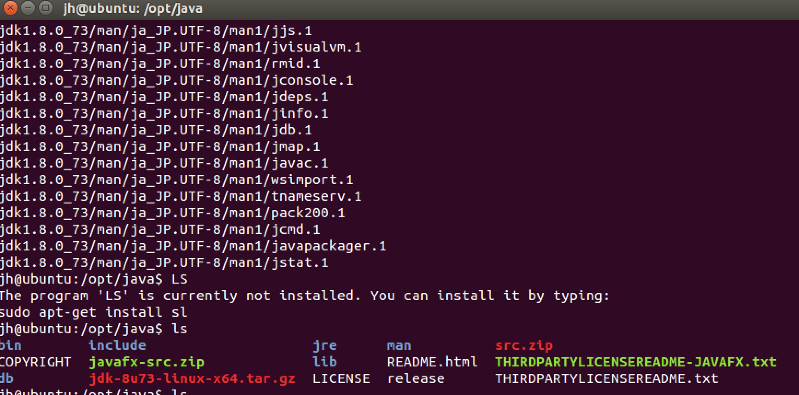

## Ubuntu下JAVA开发环境的配置

### 1. 下载 JDK

建JAVA开发环境，第一步就是要安装JDK。在这里下载：[Java SE Development Kit 8 - Downloads](http://www.oracle.com/technetwork/java/javase/downloads/jdk8-downloads-2133151.html)


### 2. 解压 JDK 压缩文件

首先在 `/opt` 目录下新建 `software` 目录，并在该目录下新建 `java` 目录。
```
sudo mkdir /opt/software && sudo mkdir /opt/software/java
cd /opt/software/java
```

然后将下载的软件移动到 `/opt/software/java` 目录。

```
sudo mv ~/Downloads/jdk-8u73-linux-x64.tar.gz .
```

再然后解压压缩包：

```
 sudo tar -zxvf jdk-8u73-linux-x64.tar.gz
```

完整命令截图如下：


解压后大概是这样的：




### 3. 配置环境变量

 


