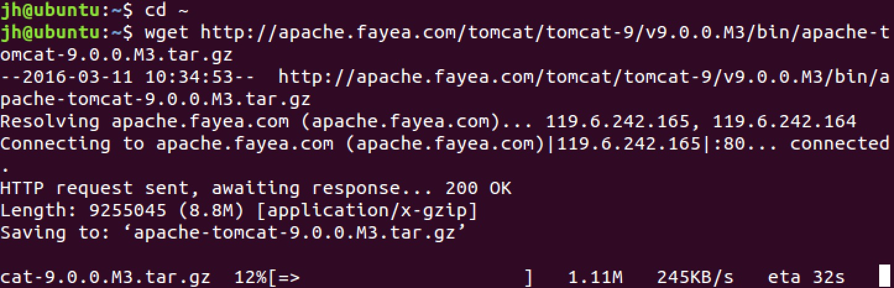
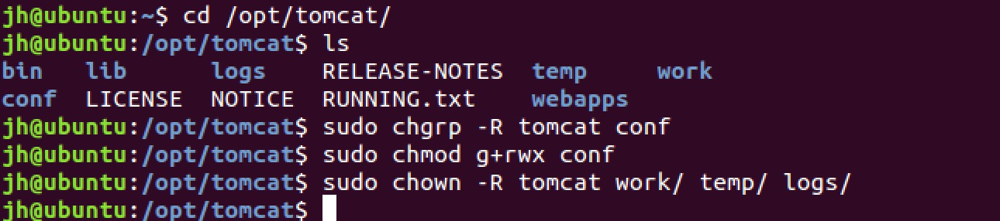
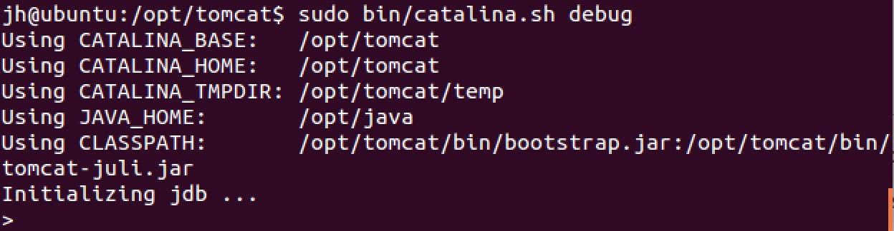
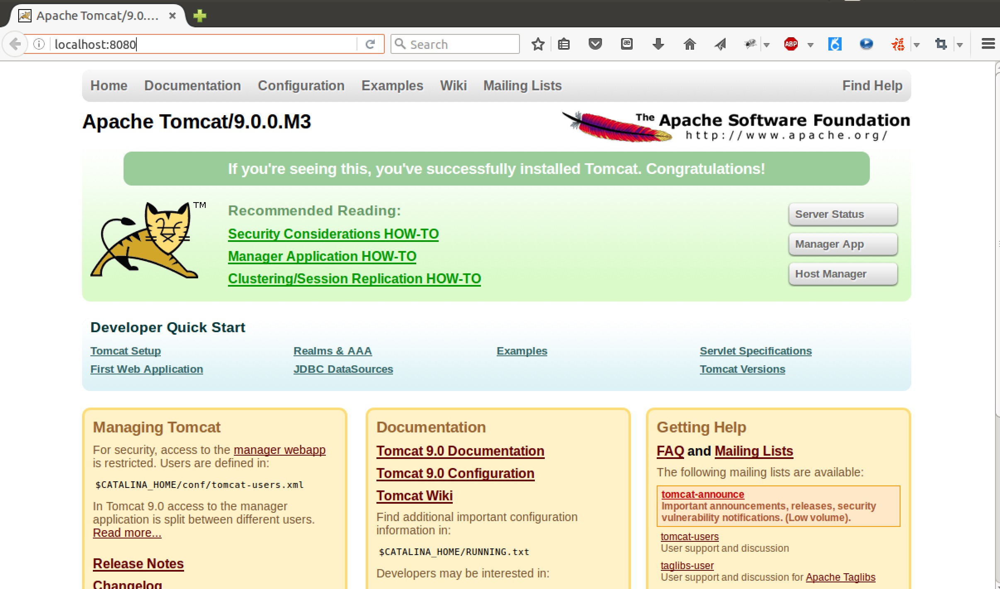

## Ubuntu 下 Tomcat 的配置

### 1. 安装 JAVA

在安装 Tomcat 之前，必须得先安装 JDK 或 JRE。
JRE 是JAVA 程序运行的基础，它提供了 JVM 等 JAVA 运行环境。而 JDK 是给开发JAVA程序的人员提供了包括JRE在内的基本环境以及一些开发工具，例如 JAVAC。
Tomcat 是使用 JAVA 进行 Web 开发的应用服务器（Application Server）软件。当从网络上有请求到达 Tomcat 服务器时，它会根据请求的地址来调用你写的 JAVA 程序模块。

简单来说，假设 `http://xxx.com` 是一个 Java 写的网站，那么当在浏览器输入网址并敲下回车后，Tomcat 会得到一个希望访问 `/`（根目录资源）的请求。然后它去配置文件里查根目录对应的模块是什么。假设查到的模块是 `root` 这个类，那么它会去调用 `root.doGet()` 方法。而你写一个 Servlet 的时候，必须实现 `doGet()`方法，此时你的方法被调用，那么你写的代码就运行了。

当然，实际情况会比这个更复杂。

如果还没有安装 JAVA 开发环境，可参考：[Ubuntu下JAVA开发环境的配置](install-jdk-on-ubuntu.md)

### 2. 创建 `tomcat` 用户

为了安全考虑，Tomcat 需要以普通用户的权限来运行。所以我们将创建一个用户和用户组，来运行 Tomcat 服务。

首先，创建一个 `tomcat` 用户组：

```
sudo groupadd tomcat
```

然后我们再创建一个 `tomcat` 用户，该用户有如下条件：

+ `tomcat` 用户属于 `tomcat` 用户组；
+ `tomcat` 用户主目录为 `/opt/tomcat`，这个目录也是我们将用来安装 tomcat 的目录（当然也可以是你喜欢的其他目录）；
+ `tomcat` 不能登录

所创建 `tomcat` 用户的命令如下：

```
sudo useradd -s /bin/false -g tomcat -d /opt/tomcat tomcat
```

### 安装 Tomcat

#### 下载 Tomcat 二进制文件

首先下载 Tomcat。目前 Tomcat 的最新版本是 9.0.0.M3。可以在 [http://tomcat.apache.org](http://tomcat.apache.org) 找到最新版本的 Tomcat，然后拷贝其二进制链接地址，在终端使用 `wget` 命令进行下载：

```
cd ~
wget http://apache.fayea.com/tomcat/tomcat-9/v9.0.0.M3/bin/apache-tomcat-9.0.0.M3.tar.gz
```


然后我们需要将 Tomcat 安装到 `/opt/tomcat` 目录下面。

接下来创建安装目录，并将下载的二进制包解压到该目录。

```
sudo mkdir /opt/tomcat
sudo tar zxvf apache-tomcat-9.0.0.M3.tar.gz -C /opt/tomcat --strip-components=1
```

#### 设置 Tomcat 用户权限

用户 `tomcat` 需要有合适的权限来运行 Tomcat 服务，所以接下来需要设置用户权限。

首先进入到 Tomcat 的安装目录：

```
cd /opt/tomcat
```

然后设置 `tomcat` 用户对 `conf` 目录的写权限，以及对其子目录的读权限：

```
sudo chgrp -R tomcat conf
sudo chmod g+rwx conf
```
接下来需要设置 `tomcat` 用户对 `work/`、`temp/` 、`logs/` 这几个目录的所有权：

```
sudo chown -R tomcat work/ temp/ logs/
```

完整命令如下图：



#### 设置环境变量

Tomcat 运行的时候依赖于 JDK 或 JRE。所以还需要为 Tomcat 指定 JDK 或 JRE 的路径。按理说只要有 JRE 就够了，但要使用 Tomcat 的更多功能，如 debug，还需要 JDK。所以建议设置 JDK 的路径。

设置环境变量的方法是在 `bin/` 目录下新建一个 `setenv.sh` 目录，然后将 `JAVA_HOME=/opt/java` 写入到该文件： 

```
sudo vim bin/setenv.sh
```


环境变量设置完毕后就可以通过 `catalina.sh` 命令来启动 Tomcat 了。如图：

```
sudo bin/catalina.sh start
```



一切正常的话，就会提示 Tomcat 启动成功，那么 Tomcat。然后在浏览器中输入 `localhost:8080` 就可以看到 Tomcat 的主界面：




