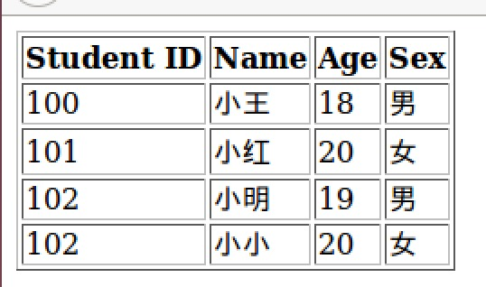

# 通过 JSP 访问数据库

## 1. 安装 JSTL 

JSP标准标签库（JSTL）是一个 JSP 标签集合，它封装了 JSP 应用的通用核心功能。

JSTL 支持通用的、结构化的任务，比如迭代，条件判断，XML文档操作，国际化标签，SQL标签。 除了这些，它还提供了一个框架来使用集成 JSTL 的自定义标签。

关于 JSTL 更详细的内容可参考：[JSP 标准标签库（JSTL）](http://www.runoob.com/jsp/jsp-jstl.html)

Apache Tomcat 安装JSTL 库步骤如下：

+ 从Apache的标准标签库中下载的二进包(`jakarta-taglibs-standard-current.zip`)。下载地址：`http://archive.apache.org/dist/jakarta/taglibs/standard/binaries/`
+ 下载 `jakarta-taglibs-standard-1.1.1.zip` 包并解压，将 `jakarta-taglibs-standard-1.1.1/lib/` 下的两个jar 文件：`standard.jar` 和 `jstl.jar` 文件拷贝到 `/WEB-INF/lib/` 下。

命令如下（`$` 表示终端）：

```
$ wget http://archive.apache.org/dist/jakarta/taglibs/standard/binaries/jakarta-taglibs-standard-1.1.2.tar.gz

$ tar -zxvf jakarta-taglibs-standard-1.1.2.tar.gz

$ cp jakarta-taglibs-standard-1.1.2/lib/standard.jar /opt/tomcat8/webapps/ROOT/WEB-INF/lib/

$ cp jakarta-taglibs-standard-1.1.2/lib/jstl.jar /opt/tomcat8/webapps/ROOT/WEB-INF/lib/
```

### 2. 安装 JDBC

JDBC（Java Data Base Connectivity,java 数据库连接）是一种用于执行 SQL 语句的 Java API ，可以为多种关系数据库提供统一访问，它由一组用Java语言编写的类和接口组成。

在这里下载 JDBC：[Begin Your Download - mysql-connector-java-5.1.38.tar.gz](http://dev.mysql.com/downloads/connector/j/)

当然，也可以在终端使用 `wget` 进行下载。下载后解压，并将压缩包里面的 放在`/WEB-INF/lib/` 下

```
$ wget http://dev.mysql.com/get/Downloads/Connector-J/mysql-connector-java-5.1.38.tar.gz

$ tar -zxvf mysql-connector-java-5.1.38.tar.gz

$ cp mysql-connector-java-5.1.38/mysql-connector-java-5.1.38-bin.jar /opt/tomcat8/webapps/ROOT/WEB-INF/lib/
```

### 3. 重启 Tomcat

**安装新的 jar 文件后，都需要重新启动 Tomcat。**

```
$ sudo /opt/tomcat8/bin/catalina.sh stop

$ sudo /opt/tomcat8/bin/catalina.sh start
```

### 4. 创建数据库和表

我们在 MySQL 里创建一个名为 `school` 的数据库，然后创建一个 `student` 表，用来存储学生基本信息。

这次我们使用命令来进行数据库和表的创建，首先打开终端，进入数据库：

```
$ mysql -uroot -p 
```

输入密码后，就可以进入 MySQL 的控制台。然后创建 `school` 数据库：

```
mysql> create database school default character set utf8;
```

这里在创建表的时候，指定了字符集为 `utf8`，主要是为了避免中文乱码的问题。


接下来在 `school` 这个数据库里面创建一张 `student` 表：
```
mysql> use school;
mysql> create table student
    (
     id int not null auto_increment,
     age int not null,
     name varchar (255),
     sex varchar (10),
     PRIMARY KEY  (`id`)
    ) ENGINE=InnoDB DEFAULT CHARSET=utf8; 
```

接下来再往 `student` 表里面插入一些数据：

```
mysql> INSERT INTO student VALUES (null, 18, '小王', '男');
mysql> INSERT INTO student VALUES (null, 20, '小红', '女');
mysql> INSERT INTO student VALUES (null, 19, '小明', '男');
mysql> INSERT INTO student VALUES (null, 20, '小小', '女');
```


### 5. 使用 JSP 连接数据库

下面这段代码展示了如何连接数据库，并从数据库中查询信息：

```
<%@ page import="java.io.*,java.util.*,java.sql.*"%>
<%@ page import="javax.servlet.http.*,javax.servlet.*" %>
<%@ taglib uri="http://java.sun.com/jsp/jstl/core" prefix="c"%>
<%@ taglib uri="http://java.sun.com/jsp/jstl/sql" prefix="sql"%>
 
<html>
<head>
<title>SELECT Operation</title>
</head>
<body>
 
<sql:setDataSource var="snapshot" driver="com.mysql.jdbc.Driver"
     url="jdbc:mysql://localhost/school"
     user="root"  password="root"/>
 
<sql:query dataSource="${snapshot}" var="result">
SELECT * from student;
</sql:query>
 
<table border="1">
<tr>
   <th>Student ID</th>
   <th>Name</th>
   <th>Age</th>
   <th>Sex</th>
</tr>
<c:forEach var="row" items="${result.rows}">
<tr>
   <td><c:out value="${row.id}"/></td>
   <td><c:out value="${row.name}"/></td>
   <td><c:out value="${row.age}"/></td>
   <td><c:out value="${row.sex}"/></td>
</tr>
</c:forEach>
</table>
 
</body>
</html>
```

其中第 13 行 `<sql:setDataSource />` 标签主要是数据库信息的配置，`user` 是`数据库用户名`，	`password` 是数据库密码，将其改为你的数据库用户名和密码。然后访问这个 JSP 例子，运行结果如下：




test

