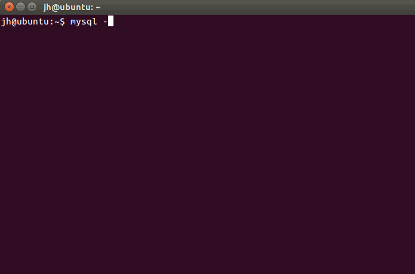

## MySQL 的基本使用

### 1. 进入 MySQL 控制台

```
mysql -uroot -p
```

`-u` 后面跟的是用户名，`-p` 表示通过输入密码的方式登陆 MySQL 控制台。安装完 MySQL 的时候，会提示设置 root 用户的密码。刚安装完 MySQL 后，就只有 `root` 这一个用户。

输入上面这行命令后，就会提示输入密码。如果密码正确，就会出现如下界面：




### 2. 查看数据库

MySQL 查看有哪些数据库的命令是：

```
show databases
```

这里 `查看数据库` 中的 `数据库`，是指的 MySQL 数据库里面的一些表的集合。而 `MySQL 数据库` 里面的 `数据库`，指的是数据库这个软件。不同的语境有不同的意思。

在 MySQL 控制台里，我们可以使用下面的命令来查看我们的数据库软件里面创建了哪些数据库，**需要注意的是，MySQL 控制台里面的所有命令都需要以 `；` 结尾**：

 `mysql> show databases;`
 
  


如图所示， MySQL 会有几个默认的数据库，他们的作用分别是：

+ information_schema 是信息数据库，其中保存着关于MySQL服务器所维护的所有其他数据库的信息。
+ mysql 是 MySQL 的核心数据库，主要负责存储数据库的用户、权限设置、关键字等mysql自己需要使用的控制和管理信息。
+ performance_schema 是 MySQL 5.5 版本新增的一个性能优化的引擎。以后再讲。


### 3. 新建数据库

MySQL 新建数据库的命令是：

```
create database database_name;
```

其中 `database_name` 是你要创建的数据库的名字。如图，我们新建一个叫做 `student` 的数据库，主要用来存储学生信息，然后我们再查看有哪些数据库的时候，就会发现多了一个名为 `student` 的数据库：

```
mysql> create dtabase student;
mysql> show databases;
```

  


### 4. 使用某个数据库

创建完数据库后，我们需要使用刚刚创建的数据库，需要用到下面的命令：

```
use database_name
```

其中 `database_name` 是你的数据库名字。

比如我们现在要使用刚才新建的 `student` 这个数据库，那么就：

```
mysql> use student;
```


