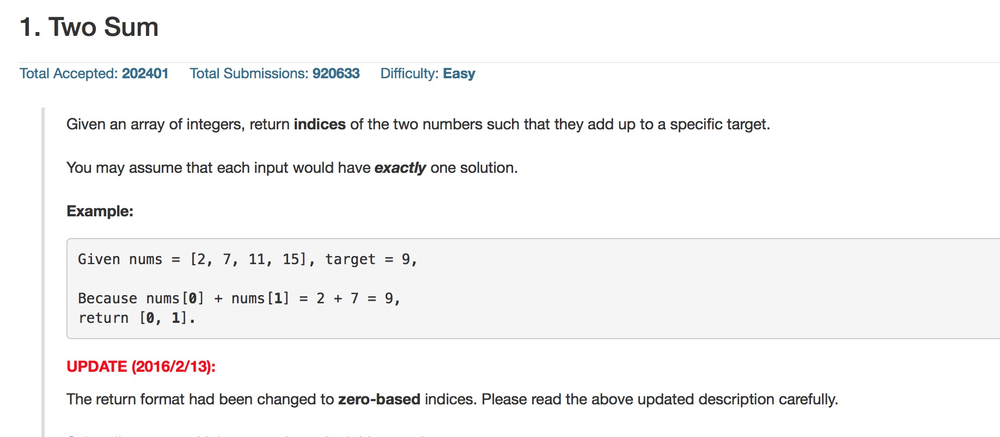

### 题目

[Two Sum](https://leetcode.com/problems/two-sum/)




###  思路

首先循环遍历 nums 数组，然后再在之前的循环里面再次循环 nums，然后找到两个和为 target 的下标，存入变量 res。

由于 res 是局部变量，函数结束，内存被回收，所以使用 malloc 分配内存。

之前没有使用 malloc，所以调试了很长时间。

### 代码：

```
int* twoSum(int* nums, int numsSize, int target) {
	int i, j;
	int *res = (int* )malloc(sizeof(int) * 2);

	for (i=0;i<numsSize;i++) {
		for(j=i+1;j<numsSize;j++) {
			if ((nums[i] + nums[j]) == target) {
				res[0] = i;
				res[1] = j;
				break;
			}
		}
	}
	return res;
}
```

### 时间复杂度 

O(n^2)


