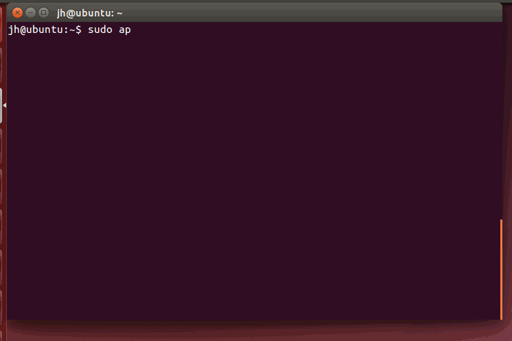
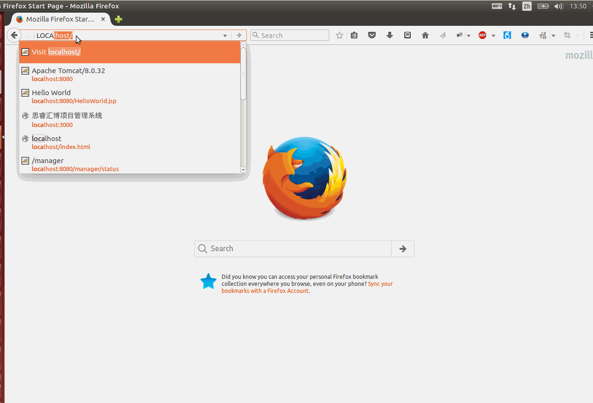
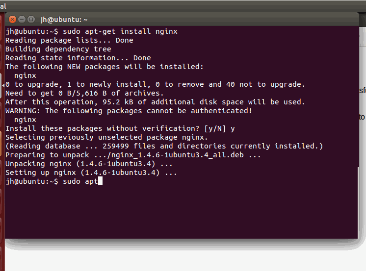
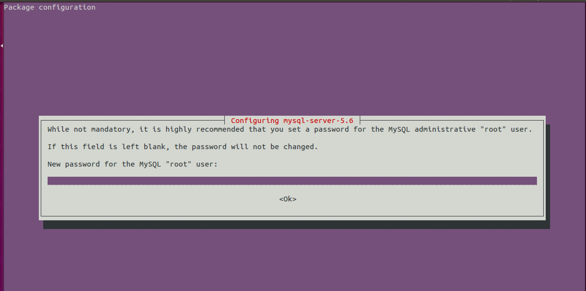

## 在 Ubuntu 下搭建 PHP、MySQL、Nginx（LEMP）开发环境

### 1. Web Server 介绍

Web Server（Web 服务器或网页服务器）是一个提供网页的服务器程序。每一个网页服务器程序都需要从网络接受HTTP请求，然后提供HTTP回复给请求者。HTTP回复一般包含一个HTML文件，有时也可以包含纯文本文件、图像或其他类型的文件。

现在市面上普遍的网页（HTTP）服务器有：

+ Apache软件基金会的Apache HTTP服务器
+ Microsoft的Internet Information Server（IIS）
+ Google的Google Web Server
+ Nginx公司的nginx
+ 淘宝从nginx改良的Tengine
+ lighttpd公司的lighttpd
+ Cherokee_(Web服务器)
+ Microsoft的FrontPage

以下是顶级网服务器的市场份额在互联网上通过[[en:Netcraft|Netcraft公司]最新统计数据：2014年4月与5月的调查

|产品|	供应商|2014年4月|百分比|2014年5月|百分比|变化|
|:---:|:---:|:---:|:---:|:---:|:---:|:---:|
|Apache|Apache|361,853,003|37.74%|366,262,346|37.56%|-0.18%
|IIS|微软|316,843,695|33.04%|325,854,054	|33.41%|+0.37%
|nginx|NGINX, Inc.|146,204,067|15.25%|142,426,538|14.60%|-0.64%|GWS|谷歌|20,983,310|2.19%|20,685,165|2.12%|-0.07%|

Apache，IIS和Nginx的是互联网上最常用的Web服务器。

严格的来说，Apache/Nginx 应该叫做「HTTP Server」；而 Tomcat 则是一个「Application Server」，或者更准确的来说，是一个「Servlet/JSP」应用的容器（Ruby/Python 等其他语言开发的应用也无法直接运行在 Tomcat 上）。

HTTP Server 主要是做静态内容的代理，涉及的主要是 HTTP 协议层面的传输和访问控制，客户端通过 HTTP Server 访问服务器上存储的资源（HTML 文件、图片文件等等）。

而应用服务器，则是一个应用执行的容器。它首先需要支持开发语言的 Runtime（对于 Tomcat 来说，就是 Java），保证应用能够在应用服务器上正常运行。其次，需要支持应用相关的规范，例如类库、安全方面的特性。对于 Tomcat 来说，就是需要提供 JSP/Sevlet 运行需要的标准类库、Interface 等。


为了方便，应用服务器往往也会集成 HTTP Server 的功能，但是不如专业的 HTTP Server 那么强大，所以应用服务器往往是运行在 HTTP Server 的背后，执行应用，将动态的内容转化为静态的内容之后，通过 HTTP Server 分发到客户端。

### 2. 安装 Nginx

安装 Nginx 很简单：

```
sudo apt-get install nginx
```



安装完成后在浏览器中输入 `localhost`，如果出现了 Nginx 的欢迎页面，就说明 Nginx 安装成功。

Nginx 使用的是 `80` 端口，Tomcat 使用的是 `8080` 端口。用浏览器访问网页的时候，如果主机后面不加端口号，就默认使用 `80` 端口，所以 `localhost` 和 `localhost:80` 是一样的。




### 3. 安装 MySQL

MySQL 是一个关系型数据库。使用下面的命令进行安装：

```
sudo apt-get install mysql-server
```


安装过程中会出现一个配置密码的窗口，可以在这里设置 MySQL 的 root 帐户的密码。如果是搭建本地开发环境，密码可以设置得相对简单；如果是在服务器上进行配置，密码最好不能轻易让人猜中。



安装成功后，可以使用 `sudo service mysql` 命令对 MySQL 进行管理。

```
jh@ubuntu:~$ sudo service mysql
Usage: /etc/init.d/mysql start|stop|restart|reload|force-reload|status
```

如上，其中 `sudo service mysql` 后面的参数可以是 `start|stop|restart|reload|force-reload|status`。例如 `sudo service mysql restart` 就是重启 MySQL。


### 4. 安装 PHP

现在我们已经安装好了 Nginx 和 MySQL，但我们还需要使用一种服务器端（后端）语言来开发动态网站。

后端可以采用 JAVA，也可以是 PHP 或 Node.js。这里之所以选择 PHP，是因为后面我们需要用 `phpMyAdmin` 来管理我们的 MySQL 数据库。

我们使用下面的命令安装 PHP：

```
sudo apt-get install php5-fpm php5-mysql
```

然后配置一下 PHP：

```
sudo vim /etc/php5/fpm/php.ini
```


### 5. 安装 phpMyAdmin


---
参考：

+ [网页服务器](https://zh.wikipedia.org/wiki/網頁伺服器)
+ [tomcat 与 nginx，apache的区别是什么？](https://www.zhihu.com/question/32212996)
+ [how-to-install-linux-nginx-mysql-php-lemp-stack-on-ubuntu-14-04](https://www.digitalocean.com/community/tutorials/how-to-install-linux-nginx-mysql-php-lemp-stack-on-ubuntu-14-04)

