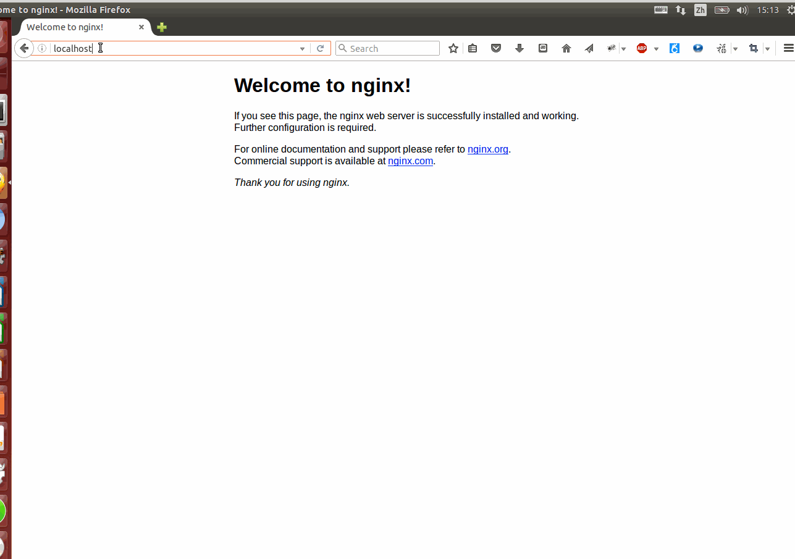

## 在 Ubuntu 下搭建 PHP、MySQL、Nginx（LEMP）开发环境

### 1. Web Server 介绍

Web Server（Web 服务器或网页服务器）是一个提供网页的服务器程序。每一个网页服务器程序都需要从网络接受 HTTP 请求，然后提供HTTP回复给请求者。HTTP 回复一般包含一个 HTML 文件，有时也可以包含纯文本文件、图像或其他类型的文件。

现在市面上普遍的网页（HTTP）服务器有：

+ Apache软件基金会的Apache HTTP服务器
+ Microsoft的Internet Information Server（IIS）
+ Google的Google Web Server
+ Nginx公司的nginx
+ 淘宝从nginx改良的Tengine
+ lighttpd公司的lighttpd
+ Cherokee_(Web服务器)
+ Microsoft的FrontPage

以下是顶级网服务器的市场份额在互联网上通过[[en:Netcraft|Netcraft公司]最新统计数据：2014年4月与5月的调查

|产品|	供应商|2014年4月|百分比|2014年5月|百分比|变化|
|:---:|:---:|:---:|:---:|:---:|:---:|:---:|
|Apache|Apache|361,853,003|37.74%|366,262,346|37.56%|-0.18%
|IIS|微软|316,843,695|33.04%|325,854,054	|33.41%|+0.37%
|nginx|NGINX, Inc.|146,204,067|15.25%|142,426,538|14.60%|-0.64%|GWS|谷歌|20,983,310|2.19%|20,685,165|2.12%|-0.07%|

Apache，IIS和Nginx的是互联网上最常用的Web服务器。

严格的来说，Apache/Nginx 应该叫做「HTTP Server」；而 Tomcat 则是一个「Application Server」，或者更准确的来说，是一个「Servlet/JSP」应用的容器（Ruby/Python 等其他语言开发的应用也无法直接运行在 Tomcat 上）。

HTTP Server 主要是做静态内容的代理，涉及的主要是 HTTP 协议层面的传输和访问控制，客户端通过 HTTP Server 访问服务器上存储的资源（HTML 文件、图片文件等等）。

而应用服务器，则是一个应用执行的容器。它首先需要支持开发语言的 Runtime（对于 Tomcat 来说，就是 Java），保证应用能够在应用服务器上正常运行。其次，需要支持应用相关的规范，例如类库、安全方面的特性。对于 Tomcat 来说，就是需要提供 JSP/Sevlet 运行需要的标准类库、Interface 等。


为了方便，应用服务器往往也会集成 HTTP Server 的功能，但是不如专业的 HTTP Server 那么强大，所以应用服务器往往是运行在 HTTP Server 的背后，执行应用，将动态的内容转化为静态的内容之后，通过 HTTP Server 分发到客户端。

### 2. 安装 Nginx

安装 Nginx 很简单：

```
sudo apt-get install nginx
```


安装完成后在浏览器中输入 `localhost`，如果出现了 Nginx 的欢迎页面，就说明 Nginx 安装成功。

Nginx 使用的是 `80` 端口，Tomcat 使用的是 `8080` 端口。用浏览器访问网页的时候，如果主机后面不加端口号，就默认使用 `80` 端口，所以 `localhost` 和 `localhost:80` 是一样的。


### 3. 安装 MySQL

MySQL 是一个关系型数据库。使用下面的命令进行安装：

```
sudo apt-get install mysql-server
```


安装过程中会出现一个配置密码的窗口，可以在这里设置 MySQL 的 root 帐户的密码。如果是搭建本地开发环境，密码可以设置得相对简单；如果是在服务器上进行配置，密码最好不能轻易让人猜中。


安装成功后，可以使用 `sudo service mysql` 命令对 MySQL 进行管理。

```
jh@ubuntu:~$ sudo service mysql
Usage: /etc/init.d/mysql start|stop|restart|reload|force-reload|status
```

如上，其中 `sudo service mysql` 后面的参数可以是 `start|stop|restart|reload|force-reload|status`。例如 `sudo service mysql restart` 就是重启 MySQL。


### 4. 安装 PHP

现在我们已经安装好了 Nginx 和 MySQL，但我们还需要使用一种服务器端（后端）语言来开发动态网站。

后端可以采用 JAVA，也可以是 PHP 或 Node.js。这里之所以选择 PHP，是因为后面我们需要用 `phpMyAdmin` 来管理我们的 MySQL 数据库。

我们使用下面的命令安装 PHP：

```
sudo apt-get install php5-fpm php5-mysql
```

然后配置一下 PHP：

```
sudo vim /etc/php5/fpm/php.ini
```

在 VIM 中找到 `cgi.fix_pathinfo` 所在的这一行，取消注释并将其值设置为 0。

VIM 在命令模式（command-mode）下可以使用正则表达式来查找。一般使用 `vim xxx.xx` 打开文件后，VIM 是处于正常模式（normal-mode）的。 如果现在是插入模式（insert-mode），先按 `ESC` 进入正常模式（normal-mode），然后输入英文冒号 `:` 进入命令模式，再然后输入 `/cgi.fix_pathinfo`，回车，就能找到 `cgi.fix_pathinfo` 这一行了。接下来再按 `i` 进入编辑模式进行编辑。


然后重启 PHP：

```
sudo service php5-fpm restart
```


### 5. 配置 Nginx 

上面的步骤完成后，我们的 LEMP 环境基本就搭建好了。

接下来再补充几点知识。

在我们配置完 Tomcat 和 Nginx 后，我们就已经知道 Tomcat 监听 `8080` 端口，Nginx 监听 `80` 端口。我们通过访问 `localhost:8080` 就得到了 Tomcat 的主页内容，通过 `localhost:80` 就得到了 Nginx 主页内容，为什么呢？

#### 端口

端口的作用：通过端口来区分出同一电脑内不同应用或者进程，从而实现一条物理网线(通过分组交换技术-比如internet)同时链接多个程序 Port_(computer_networking)。

端口号是一个 16位的 uint，所以其范围为 1 to 65535 (对TCP来说，port 0 被保留，不能被使用，对于UDP来说，source端的端口号是可选的， 为0时表示无端口)。

访问 `localhost:8080`，进程就被打标，电脑接收到的 `8080` 端口的网络消息就会被发送给我们启动的这个进程。

#### URL

RFC1738 定义的url格式笼统版本`<scheme>:<scheme-specific-part>`， scheme有我们很熟悉的 http、https、ftp，以及著名的 ed2k，thunder。

通常我们熟悉的url定义成这个样子

```
<scheme>://<user>:<password>@<host>:<port>/<url-path>
```

用过ftp的估计能体会这么长的，网页上很少带auth信息，所以就精简成这样:

```
<scheme>://<host>:<port>/<url-path>
```

在 `localhost:8080` 这个例子中, scheme=http, host=localhost, port=8080, url-path=/, 再联想对照一下浏览器端window.location对象。 著名的localhost，你可以在电脑的hosts文件上找到

> 在这篇文章中提到： URI schemes are frequently and incorrectly referred to as "protocols", or specifically as URI protocols or URL protocols, since most were originally designed to be used with a particular protocol, and often have the same name.

比较认同这个观点，尤其是今天移动设备的时代里， android和ios的开发中大量使用uri作为跨app通讯通道，把scheme理解为协议略狭隘了。


#### 网页的访问流程

假设我们有一个域名 `http://whoistheprettiestgirl.xyz/`，用户通过浏览器访问这个域名的时候，就会向该域名所指向的服务器发送一个 HTTP 请求，服务器上的 HTTP Server 接收到请求后，首先找到该请求所对应的代码文件，`http://whoistheprettiestgirl.xyz/` 没有指定 `<url-path>` ，Nginx 就会在配置文件里面寻找默认的 `<url-path>`，一般是 `index.html`。如果 Nginx 找到了这个文件，就直接浏览器返回该文件，如果没有找到或服务器出错，就会返回我们常见的 404,500 等错误码。

好了，上面说到的网页访问流程，只是静态网页的访问流程。如果为们是使用 PHP 写的一个动态网页，那么就需要让 Nginx 将请求转发到 PHP 解释器，让 PHP 解释器解释完生成一个静态网页后，再将由 Nginx 将结果返回给浏览器。

接下来就让我们来配置一下 Nginx，让 Nginx 能够将后缀名为 `.php` 的请求转发到PHP 解释器。 

首先 Nginx 的配置文件都在 `/etc/nginx` 这个目录。你可以进入该目录看看里面的内容。然后该目录下面有一个名为 `conf.d` 的目录，这个目录里面存放用户自定义的配置文件。

Nginx 首先会读取自身默认的配置，然后读取 `/ect/nginx/conf.d` 目录里面的用户配置文件。

用户自定义配置文件以 `.conf` 为后缀：

```
cd /etc/nginx/conf.d
sudo vim nginx.default.conf
```

然后将下面的内容添加进去：

```
server {
    listen 80;

    root /usr/share/nginx/html;
    index index.php index.html index.htm;

    server_name localhost;

    location / {
        try_files $uri $uri/ =404;
    }

    error_page 404 /404.html;
    error_page 500 502 503 504 /50x.html;
    location = /50x.html {
        root /usr/share/nginx/html;
    }

    location ~ \.php$ {
        try_files $uri =404;
        fastcgi_split_path_info ^(.+\.php)(/.+)$;
        fastcgi_pass unix:/var/run/php5-fpm.sock;
        fastcgi_index index.php;
        fastcgi_param SCRIPT_FILENAME $document_root$fastcgi_script_name;
        include fastcgi_params;
    }
}
```

接下来重启 Nginx：

```
sudo /etc/init.d/nginx restart
```

如果启动失败，就说明配置文件语法有误。请联系我帮你查找。

重启成功了后，进入 `/usr/share/nginx/html` 这个目录，该目录是 Nginx 默认的网站目录，类似于 Tomcat 的 `$TOMCAT/webapps/ROOT` 目录。

```
cd /usr/share/nginx/html
```

然后新建一个 `info.php` 的文件，写入下面的代码：

```
<?php 
phpinfo(); 
?>
```

该行代码的主要意思是打印出 PHP 版本等详细信息。

可以发现，PHP 与 JSP 类似，都是包含在某种标签中的。PHP 代码包含在 `<?php` 和 `?>` 里面，而 JSP 包含在 `<%` 和 `%>` 里面。


接下来再在浏览器地址栏输入 `localhost/info.php`，如果出现 PHP 版本信息，就说明 PHP 安装和 Nginx 配置都没问题了。




### 5. 安装 phpMyAdmin

phpMyAdmin 是一个 PHP 写的图形界面的 MySQL 数据库管理工具。

我们前面安装 Nginx、安装 PHP 的目的，一是为了熟悉 Web Server，二就是为了安装 phpMyADmin。因为后面 MySQL 将是我们只要使用的数据库。如果你能熟练掌握 SQL 语句，直接在终端操作数据库，当然更好；前期在对数据库命令还不是很熟悉的情况下，使用图形界面的管理工具，更有利于学习。

首先使用 `wget` 下载 phpMyAdmin，并将其解压到 `/usr/share/nginx/html`。下载和解压这两个命令之前也用过了。


```
wget https://files.phpmyadmin.net/phpMyAdmin/4.5.5.1/phpMyAdmin-4.5.5.1-all-languages.tar.gz
sudo tar zxvf phpMyAdmin-4.5.5.1-all-languages.tar.gz -C /usr/share/nginx/html/ 
```

解压后默认的目录名称是 ` phpMyAdmin-4.5.5.1-all-languages/`，为了方便，我们还要将其重命名为 `phpmyadmin`。更改文件/目录名，使用 `mv` 命令：

```
cd /usr/share/nginx/html/
sudo mv phpMyAdmin-4.5.5.1-all-languages/ phpmyadmin/
```

最后我们再来检验一下是否安装成功。在浏览器中输入 `localhost/phpmyadmin`，然后会出现一个登录界面，用户名是 root，密码是之前安装 MySQL 时设置的密码，一切正常的情况下，就可以登录到 phpMyAdmin 的 MySQL 管理界面了。


至此，我们的 LEMP 开发环境就搭建好了。

通过这节内容的学习，我相信你已经能对 Web Server 及网站是如何工作的有一个大致的了解了。

---
参考：

+ [网页服务器](https://zh.wikipedia.org/wiki/網頁伺服器)
+ [tomcat 与 nginx，apache的区别是什么？](https://www.zhihu.com/question/32212996)
+ [how-to-install-linux-nginx-mysql-php-lemp-stack-on-ubuntu-14-04](https://www.digitalocean.com/community/tutorials/how-to-install-linux-nginx-mysql-php-lemp-stack-on-ubuntu-14-04)

