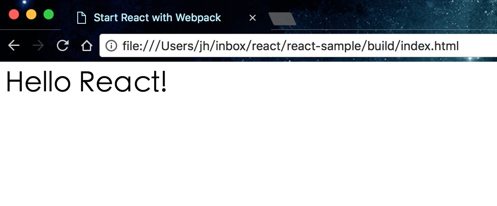

# 0. 阶段性计划

+ 熟悉 React
+ 熟悉 Rect Native，并使用 React Native 开发 Android App 
+ 使用 Java 开发相同功能的 Android App


# 1. Start React with Webpack 

看了太多资料，想不到这个标题该用什么中文了，所以就写了英文。

接下来的主要内容就是，使用 Webpack 快速构建一个简单的 React 项目。

### 安装并配置 Webpack

首先创建并初始化一个项目目录：

```
$ mkdir react-sample && cd react-sample
$ npm init
```

安装 `webpack`：

```
$ npm i webpack --save-dev
```

然后配置 `webpack.config.js`：

```
# 创建一个 webpack.config.js 文件
$ touch webpack.config.js
```

在该文件中加入下面的内容：

```
var webpack = require('webpack');
var path = require('path');

var BUILD_DIR = path.resolve(__dirname, './build');
var APP_DIR = path.resolve(__dirname, './app');

var config = {
  entry: APP_DIR + '/index.jsx',
  output: {
    path: BUILD_DIR,
    filename: 'bundle.js'
  },
  resolve: {
    extensions: ['', '.js', '.jsx']
  }
};


module.exports = config;

```

这是一个最基本的 webpack 配置文件。

接下来在 `build/` 目录中创建一个 `index.html` 文件：

```
<html>
  <head>
    <meta charset="utf-8">
    <title>Start React with Webpack</title>
  </head>
  <body>
    <div id="app" />
    <script src="./bundle.js" type="text/javascript"></script>
  </body>
</html>
```


### 配置 Babel-Loader

由于我们写 React 的时候使用的是 JSX 语法和 ES6，而浏览器并不完全支持它们。所以需要一个工具将 JSX 和 ES6 的代码转换为浏览器支持的代码，这个工具就是 Babel。

Babel 的主要作用如下图：


安装项目需要的和 Babel 有关的包：

```
$ npm i babel-loader babel-preset-es2015 babel-preset-react --save-dev
```

`babel-preset-es2015` 是转换 `ES6` 的包；`babel-preset-react` 是转换 JSX 的包。

接下来需要配置 ` babel-loader`，告诉 webpack 我们使用了 ES6 和 JSX 插件。先通过`touch .babelrc` 创建一个名为 `.babelrc` 的配置文件。然后加入下面的代码：

```
{
  "presets" : ["es2015", "react"]
}
```

然后再修改 `webpack.config.js`，使 webpack 在打包的时候，使用 `babel-loader`：

```
// Existing Code ....
var config = {
  // Existing Code ....
  module : {
    loaders : [
      {
        test : /\.jsx?/,
        include : APP_DIR,
        loader : 'babel'
      }
    ]
  }
}
```


### Hello React

安装 React：

```
$ npm i react react-dom --save
```

将下面的内容添加到 `build/index.html` 中：

```
import React from 'react';
import {render} from 'react-dom';

class App extends React.Component {
  render () {
    return <h1> Hello React!</h1>;
  }
}

render(<App/>, document.getElementById('app'));

```

这个时候，执行下面的命令打包：

```
webpack -w
```

`-w` 参数表示持续监测项目目录，如果文件发生修改，则重新打包。

打包完成后，将 `build/index.html` 用浏览器打开，就能看到 `Hello React!`，如下：


	
	
### 设置 webpack-dev-server

上面我们直接通过浏览器浏览的 `html` 文件，接下来我们需要利用 `webpack-dev-server` 来创建一个 HTTP Server。

首先安装 `webpack-dev-server`：

```
$ npm i webpack-dev-server --save-dev
```

然后在 `package.json` 的 `script` 里面加入 `build` 和 `dev` 两个命令：

```
{
  "scripts": {
    "build": "webpack",
    "dev": "webpack-dev-server --devtool eval --progress --colors --hot --content-base build"
  }
}
```

+ webpack-dev-server - 在 localhost:8080 建立一个 Web 服务器
+ --devtool eval - 为你的代码创建源地址。当有任何报错的时候可以让你更加精确地定位到文件和行号
+ --progress - 显示合并代码进度
+ --colors - Yay，命令行中显示颜色！
+ --content-base build - 指向设置的输出目录

然后就可以使用 `npm run dev` 的命令来启动项目：

```
$ npm run dev
```

在浏览器地址栏输入 `localhost:8080` 即可看到页面。


如果需要浏览器自动刷新，将 `webpack.config.js` 中的 `entry: APP_DIR + '/index.jsx` 改为下面这样：

```
entry: [
   'webpack-dev-server/client?http://localhost:8080',
   'webpack/hot/dev-server',
    APP_DIR + '/index.jsx'
]
```

这样的话，每次当代码发生变化之后，webpack 会自动重新打包，浏览器也会自动刷新页面。


### 添加一个新的组件

在 `app` 目录中新建一个 `AwesomeComponent.jsx` 文件，并添加如下代码：

```
import React, { Component } from 'react';

class AwesomeComponent extends Component {
  constructor(props) {
    super(props);
    this.state = {
      likesCount: 0
    };
    this.onLike = this.onLike.bind(this);
  }


  onLike() {
    let newLikesCount = this.state.likesCount + 1;
    this.setState({
      likesCount: newLikesCount
    });
  }


  render() {
    return (
      <div>
        Likes: <span>{this.state.likesCount}</span>
        <div>
          <button onClick={this.onLike}>Like Me</button>
        </div>
      </div>
    );
  }
}


export default AwesomeComponent;
```

然后修改 `index.jsx`：

```
// ...
import AwesomeComponent from './AwesomeComponent.jsx';
// ...
class App extends React.Component {
  render () {
    return (
      <div>
        <p> Hello React!</p>
        <AwesomeComponent />
      </div>
    );
  }
}

// ...
```


# 2. 粗略阅读《JavaScript高级程序设计》第八、九、十章

	第七章暂时跳过。总体来说，第六章和第七章都比较难，等我彻底理解了，再直接给你讲。
	
	第八、九、十章相对容易，大多是记忆性知识，目前	看一遍即可。

