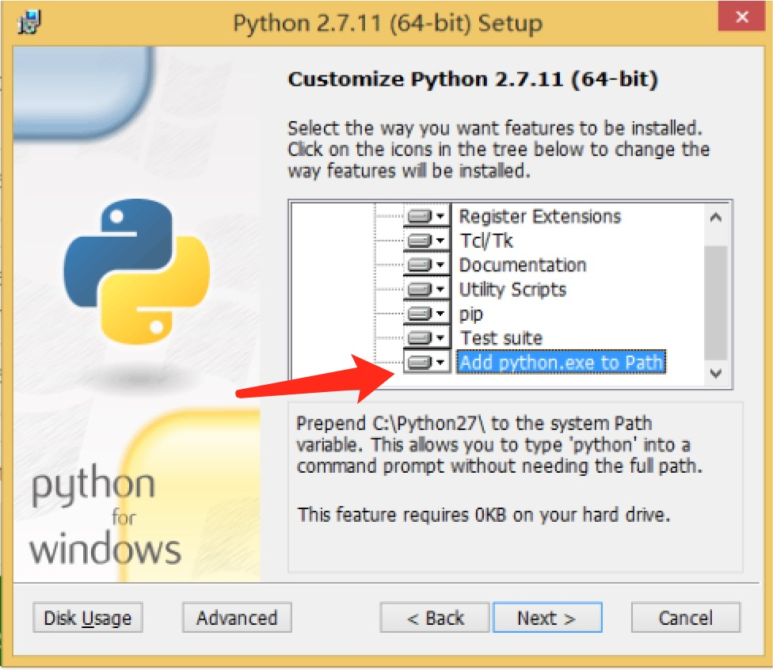

# 0. 概述

想了一下，目前你应该了解了 React 最基本的用法，至于再深层次一点的东西，暂时跳过。为了满足你想写安卓的愿望，直接从 React Native 开始。

# 1. 搭建 React Native 开发环境

这是 React Native 官网的安装教程，可以先看看。

[https://facebook.github.io/react-native/docs/getting-started.html#content](https://facebook.github.io/react-native/docs/getting-started.html#content)

但其实你的电脑上，只需要两个步骤即可。因为你已经安装了 Node.js、Android Studio。


#### 1). 安装 Python2

这里是 Python2.7.11 的下载页面。不过建议可以自己搜索 Python，然后找到下载链接。
[https://www.python.org/downloads/release/python-2711/](https://www.python.org/downloads/release/python-2711/)

安装的时候，注意要勾选上将 Python 加入到系统环境变量 `Add python.ext to Path` ：



安装完毕后，在 windows 的 cmd 里输入 `python` 命令检查是否安装成功。

#### 2). 安装 React Native

接下来的步骤基本就跟官网一致：

```
$ npm install -g react-native-cli
```

安装完成后，就可以食用 `react-native` 这个命令了。

#### 3). 初始化一个项目

使用 `react-native init projectName` 可以初始化一个项目。

```
$ react-native init AwesomeProject
$ cd AwesomeProject
```

但在编译运行安卓之前，需要先开启模拟器。

启动模拟器，可以直接在 cmd 通过命令启动，不过目前我的 windows 虚拟机上没有安装 Android Studio，所以暂时不确定命令具体怎么配置。但也可以不通过命令启动。

先找到 `Android SDK` 的安装目录，然后双击 `AVD Manager.exe` 会打开一个 AVD 的管理程序。你之前使用 Android Studio 的时候，应该安装过模拟器，所以只需要选中安装好的模拟器，再点击 `start` 即可。如果没有安装，则安装。

启动了模拟器之后，再执行 `react-native run-android` 来编译运行 React Native 项目即可。

```
$ react-native run-android
```

